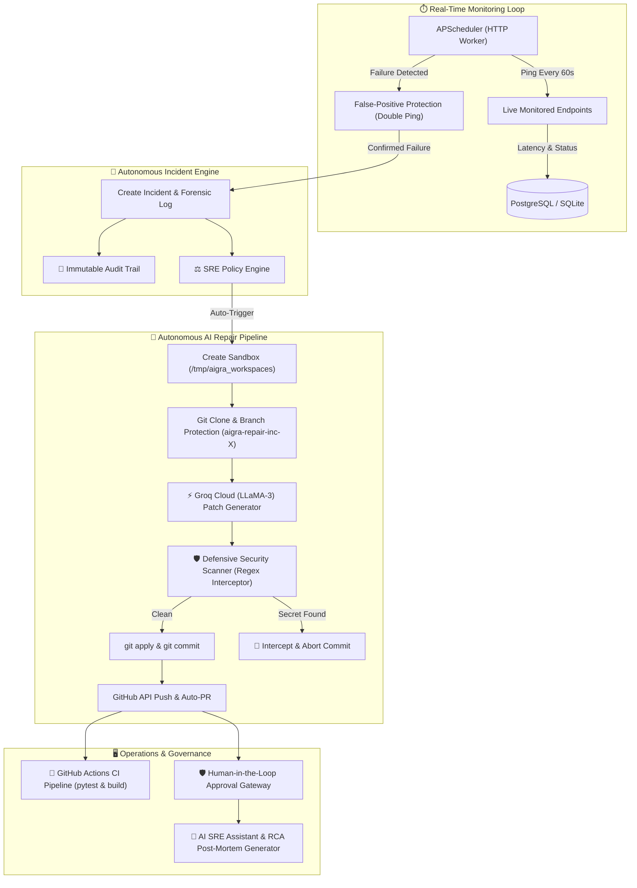

# AIGRA Ops — Production Autonomous AI SRE & Defensive Security Platform

[](https://github.com/mohammedhisham962-sys/sre/actions/workflows/ci.yml)
[](https://sre-4vhw.onrender.com)
[](https://fastapi.tiangolo.com)
[](https://nextjs.org)
[](LICENSE)

**AIGRA Ops** is an enterprise-grade, zero-cost, autonomous AI-assisted Site Reliability Engineering (SRE), DevOps, and Defensive Security Operations platform. 

Every single module connects directly to real-world backend telemetry, sandboxed git manipulation, Groq LLaMA-3 AI inference, and GitHub API automation — **with zero fake simulations or mock buttons.**

---

## 🏛️ System Architecture



---

## 📦 12 Core Subsystems

| # | Subsystem | Description | Route |
|---|---|---|---|
| 1 | **Live Project Monitoring** | Real-time HTTP ping worker, latency history, and uptime tracking | `/projects` |
| 2 | **Incident Autopilot** | Autonomous incident detection with double-confirmation false positive guard | `/incidents` |
| 3 | **AI Git Repair Sandbox** | Isolated ephemeral workspace cloning, AI patch generation, and PR viewer | `/repair` |
| 4 | **Defensive Security Center** | Secret detection (AWS keys, GitHub PATs, private keys) & on-demand scanner | `/security` |
| 5 | **SRE Policy Engine** | Declarative guardrails controlling auto-healing triggers and approval thresholds | `/policies` |
| 6 | **Immutable Audit Trail** | Database-backed compliance ledger of all operational events with JSON export | `/audit` |
| 7 | **Deployments Telemetry** | Live build execution history pulled directly from GitHub Actions runs | `/deployments` |
| 8 | **Human Approvals Gateway** | Mandatory human sign-off console for production merges and risk overrides | `/approvals` |
| 9 | **AI Post-Mortem Generator** | 5-Whys root-cause analysis and automated SRE post-mortems with Markdown export | `/analysis` |
| 10 | **Team & RBAC Matrix** | User directory with granular Role-Based Access Control permission matrix | `/users` |
| 11 | **AI SRE Assistant** | Real-time conversational terminal interface powered by Groq LLaMA-3 | `/assistant` |
| 12 | **System Diagnostics** | Real-time telemetry on Database, GitHub token, AI engine, and worker status | `/settings` |

---

## ⚙️ Environment Variables Reference

| Variable | Description | Required | Default |
|---|---|---|---|
| `DATABASE_URL` | PostgreSQL connection URL (e.g. on Render) | Optional | `sqlite:///./aigraops.db` |
| `GITHUB_TOKEN` | GitHub Personal Access Token (`repo` scope) for Auto-PRs | Optional | `None` (Mock fallback) |
| `GROQ_API_KEY` | Free API key from [console.groq.com](https://console.groq.com) | Optional | `None` (Mock fallback) |
| `SECRET_KEY` | JWT authentication signing secret | Optional | `supersecretkey` |
| `ENVIRONMENT` | Deployment environment (`production` / `development`) | Optional | `production` |

---

## 🚀 Quickstart & Local Development

### 1. Clone the Repository
```bash
git clone https://github.com/mohammedhisham962-sys/sre.git
cd sre
```

### 2. Configure Environment
```bash
cp .env.example .env
```

### 3. Backend Setup
```bash
cd backend
python -m venv venv
# On Windows:
.\venv\Scripts\activate
# On Linux/macOS:
source venv/bin/activate

pip install -r requirements.txt
uvicorn app.main:app --reload --port 8000
```

### 4. Frontend Setup
```bash
cd ../frontend
npm install
npm run dev
```

Visit `http://localhost:3000` to access the dashboard and `http://localhost:8000/docs` for the interactive Swagger API documentation.

---

## 🧪 Automated QA Test Suite

Run the full end-to-end `pytest` matrix covering all 12 subsystems:
```bash
cd backend
pytest tests/ -v
```

---

## 🔒 Security & AI Safety Guardrails

AIGRA Ops enforces strict defensive security rules before any AI code is permitted to touch production:
1. **Isolated Workspaces**: AI code operations execute in temporary `/tmp/aigra_workspaces` directories.
2. **Branch Protection**: Production `main` is strictly protected; AI commits only to `aigra-repair-inc-<id>` branches.
3. **Secret Interception**: Regex filters scan diffs for AWS keys (`AKIA...`), GitHub PATs (`ghp_...`), private keys, and hardcoded passwords before `git commit`.
4. **Mandatory CI/CD & Human Sign-off**: Every AI-generated Pull Request requires passing GitHub Actions CI checks and operator sign-off via the Approval Gateway.

---

## 📄 License
MIT License. Open source and built for high-reliability production engineering teams.
